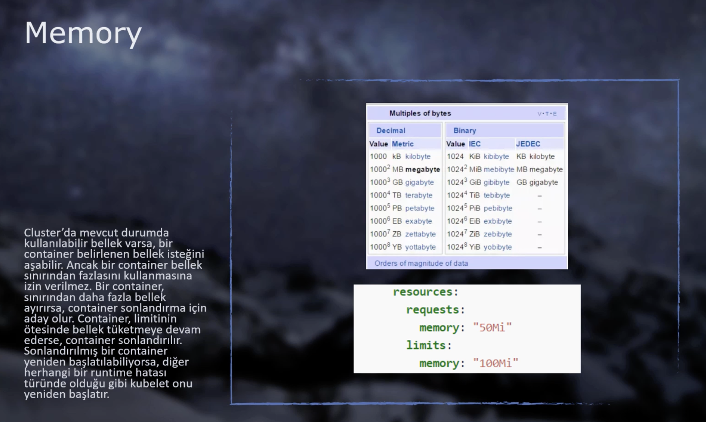

# 🔑 Liveness, Readiness, Resource Limits, Env. Variables

## Liveness Probes

Bazen container’ların içerisinde çalışan uygulamalar, tam anlamıyla doğru çalışmayabilir. Çalışan uygulama çökmemiş, kapanmamış ama aynı zamanda tam işlevini yerine getirmiyorsa kubelet bunu tespit edemiyor.

Liveness, sayesinde container’a **bir request göndererek, TCP connection açarak veya container içerisinde bir komut çalıştırarak** doğru çalışıp çalışmadığını anlayabiliriz.

_Açıklama kod içerisinde_ :arrow\_down:

```shell
# http get request gönderelim.
# eğer 200 ve üzeri cevap dönerse başarılı!
# dönmezse kubelet container'ı yeniden başlatacak.
apiVersion: v1
kind: Pod
metadata:
  labels:
    test: liveness
  name: liveness-http
spec:
  containers:
  - name: liveness
    image: k8s.gcr.io/liveness
    args:
    - /server
    livenessProbe:
      httpGet:	# get request'i gönderiyoruz.
        path: /healthz # path tanımı
        port: 8080 # port tanımı
        httpHeaders: # get request'imize header eklemek istersek
        - name: Custom-Header
          value: Awesome
      initialDelaySeconds: 3 # uygulama hemen ayağa kalkmayabilir,
      											 # çalıştıktan x sn sonra isteği gönder.
      periodSeconds: 3 # kaç sn'de bir bu istek gönderilecek. 
      								 # (healthcheck test sürekli yapılır.)
---
# uygulama içerisinde komut çalıştıralım.
# eğer exit -1 sonucu alınırsa container baştan başlatılır.
apiVersion: v1
kind: Pod
metadata:
  labels:
    test: liveness
  name: liveness-exec
spec:
  containers:
  - name: liveness
    image: k8s.gcr.io/busybox
    args:
    - /bin/sh
    - -c
    - touch /tmp/healthy; sleep 30; rm -rf /tmp/healthy; sleep 600
    livenessProbe:
      exec:  			# komut çalıştırılır.
        command:
        - cat
        - /tmp/healthy
      initialDelaySeconds: 5
      periodSeconds: 5
---
# tcp connection yaratalım. Eğer başarılıysa devam eder, yoksa 
# container baştan başlatılır.
apiVersion: v1
kind: Pod
metadata:
  name: goproxy
  labels:
    app: goproxy
spec:
  containers:
  - name: goproxy
    image: k8s.gcr.io/goproxy:0.1
    ports:
    - containerPort: 8080
    livenessProbe:	# tcp connection yaratılır.
      tcpSocket:
        port: 8080
      initialDelaySeconds: 15
      periodSeconds: 20
```

## Readiness Probes

.png>)

#### **Örnek Senaryo**

3 podumuz ve 1 LoadBalancer service’imiz var. Bir güncelleme yaptık; yeni bir image oluşturduk. Eski podlar devreden çıktı, yenileri alındı. Yenileri alındığından itibaren LoadBalancer gelen trafiği yönlendirmeye başlayacaktır. Peki, benim uygulamalarım ilk açıldığında bir yere bağlanıp bir data çekip, bunu işliyor ve sonra çalışmaya başlıyorsa? Bu süre zarfında gelen requestler doğru cevaplanamayacaktır. Kısacası, uygulamamız çalışıyor ama hizmet sunmaya hazır değil.

–> **Kubelet,** bir containerın ne zaman trafiği kabul etmeye (Initial status) hazır olduğunu bilmek için **Readiness Probes** kullanır. Bir Poddaki tüm container’lar Readiness Probes kontrolünden onay alırsa **Service Pod’un arkasına eklenir.**

Yukarıdaki örnekte, yeni image’lar oluşturulurken eski Pod’lar hemen **terminate** edilmez. Çünkü, içerisinde daha önceden alınmış istekler ve bu istekleri işlemek için yürütülen işlemler olabilir. Bu sebeple, k8s önce bu Pod’un service ile ilişkisini keser ve yeni istekler almasını engeller. İçerideki mevcut isteklerinde sonlanmasını bekler.

`terminationGracePeriodSconds: 30` –> Mevcut işlemler biter, 30 sn bekler ve kapanır. (_30sn default ayardır, gayet yeterlidir._)

**–> Readiness ile Liveness arasındaki fark, Readiness ilk çalışma anını baz alırken, Liveness sürekli çalışıp çalışmadığını kontrol eder.**

> Örneğin; Backend’in ilk açılışta MongoDB’ye bağlanması için geçen bir süre vardır. MongoDB bağlantısı sağlandıktan sonraPod’un arkasına Service eklenmesi mantıklıdır. **Bu sebeple, burada readiness’i kullanabiliriz.**

Aynı Liveness’ta olduğu gibi 3 farklı yöntem vardır:

* **http/get**, **tcp connection** ve **command çalıştırma**.

```shell
apiVersion: apps/v1
kind: Deployment
metadata:
  name: frontend
  labels:
    team: development
spec:
  replicas: 3
  selector:
    matchLabels:
      app: frontend
  template:
    metadata:
      labels:
        app: frontend
    spec:
      containers:
      - name: frontend
        image: ozgurozturknet/k8s:blue
        ports:
        - containerPort: 80
        livenessProbe:
          httpGet:
            path: /healthcheck
            port: 80
          initialDelaySeconds: 5
          periodSeconds: 5
        readinessProbe:
          httpGet:
            path: /ready	# Bu endpoint'e istek atılır, OK dönerse uygulama çalıştırılır.
            port: 80
          initialDelaySeconds: 20 # Başlangıçtan 20 sn gecikmeden sonra ilk kontrol yapılır.
          periodSeconds: 3 # 3sn'de bir denemeye devam eder.
          terminationGracePeriodSconds: 50 # Yukarıda yazıldı açıklaması.
---
apiVersion: v1
kind: Service
metadata:
  name: frontend
spec:
  selector:
    app: frontend
  ports:
    - protocol: TCP
      port: 80
      targetPort: 80
```

## Resource Limits

\-> Pod’ların CPU ve Memory kısıtlamalarını yönetmemizi sağlar. Aksini belirtmediğimiz sürece K8s üzerinde çalıştığı makinenin CPU ve Memory’sini %100 kullanabilir. Bu durum bir sorun oluşturur. Bu sebeple Pod’ların ne kadar CPU ve Memory kullanacağını belirtebiliriz.

### CPU Tanımı

.png>)

### Memory Tanımı



### YAML Dosyasında Tanım

```shell
apiVersion: v1
kind: Pod
metadata:
  labels:
    test: requestlimit
  name: requestlimit
spec:
  containers:
  - name: requestlimit
    image: ozgurozturknet/stress
    resources:
      requests: # Podun çalışması için en az gereken gereksinim
        memory: "64M"	# Bu podu en az 64M 250m (yani çeyrek core)
        cpu: "250m" # = Çeyrek CPU core = "0.25"
      limits: # Podun çalışması için en fazla gereken limit
        memory: "256M"
        cpu: "0.5" # = "Yarım CPU Core" = "500m"
```

–> Eğer gereksinimler sağlanamazsa **container oluşturulamaz.**

–> Memory, CPU’ya göre farklı çalışıyor. K8s içerisinde memory’nin limitlerden fazla değer istediğinde engellemesi gibi bir durum yok. Eğer memory, limitlerden fazlasına ihtiyaç duyarsa “OOMKilled” durumuna geçerek pod restart edilir.

> **Araştırma konusu:** Bir pod’un limitlerini ve min. gereksinimlerini neye göre belirlemeliyiz?

## Environment Variables

Örneğin, bir node.js sunucusu oluşturduğumuzu ve veritabanı bilgilerini sunucu dosyaları içerisinde sakladığımızı düşünelim. Eğer, sunucu dosyalarından oluşturduğumuz container image’ı başka birisinin eline geçerse büyük bir güvenlik açığı meydana gelir. Bu sebeple **Environment Variables** kullanmamız gerekir.

### YAML Tanımlaması

```shell
apiVersion: v1
kind: Pod
metadata:
  name: envpod
  labels:
    app: frontend
spec:
  containers:
  - name: envpod
    image: ozgurozturknet/env:latest
    ports:
    - containerPort: 80
    env:
      - name: USER   # önce name'ini giriyoruz.
        value: "Ozgur"  # sonra value'sunu giriyoruz.
      - name: database
        value: "testdb.example.com"
```

### Pod içinde tanımlanmış Env. Var.’ları Görmek

```shell
kubectl exec <podName> -- printenv
```

## Port-Forward (Local -> Pod)

–> Kendi local sunucularımızdan istediğimiz k8s cluster’ı içerisindeki object’lere direkt ulaşabilmek için **port-forward** açabiliriz. Bu object’i test etmek için en iyi yöntemlerden biridir.

```shell
kubectl port-forward <objectType>/<podName> <localMachinePort>:<podPort>

kubectl port-forward pod/envpod 8080:80
# Benim cihazımdaki 8080 portuna gelen tüm istekleri,bu podun 80 portuna gönder.

curl 127.0.0.1:8080
# Test için yazabilirsin.
```

_CMD + C yapıldığında port-forwarding sona erer._
