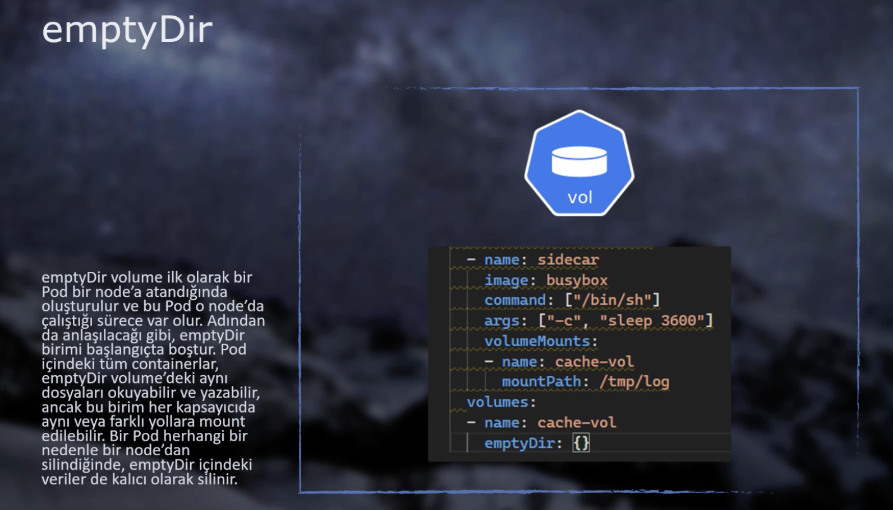
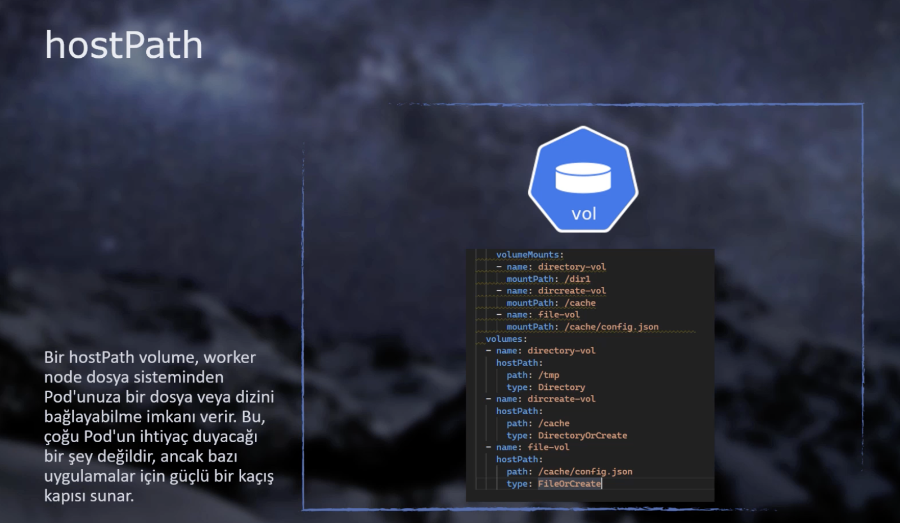

# ⚡ Volume, Secret, ConfigMap

## Volume

* Container’ın dosyaları container varolduğu sürece bir dosya içerisinde tutulur. Eğer container silinirse, bu dosyalarda birlikte silinir. Her yeni bir container yaratıldığında, container’a ait dosyalar yeniden yaratılır. (Stateless kavramı)
* Bazı containerlarda bu dosyaların silinmemesi (tutulması) gerekebilir. İşte bu durumda **Ephemeral (Geçici) Volume kavramı** devreye giriyor. (Stateful kavramı) Örneğin; DB container’ında data kayıplarına uğramamak için **volume** kurgusu yapılmalıdır.
* Ephemeral Volume’ler aynı pod içerisindeki tüm containerlara aynı anda bağlanabilir.
* Diğer bir amaç ise aynı pod içerisindeki birden fazla container’ın ortak kullanabileceği bir alan yaratmaktır.

> Ephemeral Volume’lerde Pod silinirse tüm veriler kaybolur. Fakat, container silinip tekrar yaratılırsa Pod’a bir şey olmadığı sürece veriler saklanır.

2 tip Ephemeral Volume vardır:

### emptyDir Volume



```yaml
apiVersion: v1
kind: Pod
metadata:
  name: emptydir
spec:
  containers:
  - name: frontend
    image: ozgurozturknet/k8s:blue
    ports:
    - containerPort: 80
    livenessProbe:
      httpGet:
        path: /healthcheck
        port: 80
      initialDelaySeconds: 5
      periodSeconds: 5
    volumeMounts:
    - name: cache-vol # volume ile bağlantı sağlamak için.
      mountPath: /cache # volume içerisindeki hangi dosya?
  - name: sidecar
    image: busybox
    command: ["/bin/sh"]
    args: ["-c", "sleep 3600"]
    volumeMounts:
    - name: cache-vol
      mountPath: /tmp/log # volume içerisindeki hangi dosya?
  volumes:
  - name: cache-vol # Önce volume'ü oluşturur sonra container'lara tanımlarız.
    emptyDir: {}
```

### hostPath Volume

* Çok nadir durumlarda kullanılır, kullanılırken dikkat edilmelidir.
* emptyDir’da volume klasörü pod içerisinde yaratılırken, hostPath’te volume klasörü worker node içerisinde yaratılır.
* 3 farklı tip’te kullanılır:
  * **Directory** –> Worker node üzerinde zaten var olan klasörler için kullanılır.
  * **DirectoryOrCreate** –> Zaten var olan klasörler ya da bu klasör yoksa yaratılması için kullanılır.
  * **FileOrCreate** –> Klasör değil! Tek bir dosya için kullanılır. Yoksa yaratılır.



```yaml
apiVersion: v1
kind: Pod
metadata:
  name: hostpath
spec:
  containers:
  - name: hostpathcontainer
    image: ozgurozturknet/k8s:blue
    ports:
    - containerPort: 80
    livenessProbe:
      httpGet:
        path: /healthcheck
        port: 80
      initialDelaySeconds: 5
      periodSeconds: 5
    volumeMounts:
    - name: directory-vol
      mountPath: /dir1
    - name: dircreate-vol
      mountPath: /cache
    - name: file-vol
      mountPath: /cache/config.json       
  volumes:
  - name: directory-vol
    hostPath:
      path: /tmp
      type: Directory
  - name: dircreate-vol
    hostPath:
      path: /cache
      type: DirectoryOrCreate
  - name: file-vol
    hostPath:
      path: /cache/config.json
      type: FileOrCreate
```

## Secret

* Hassas bilgileri (DB User, Pass vb.) Environment Variables içerisinde saklayabilsekte, bu yöntem ideal olmayabilir.
* Secret object’i sayesinde bu hassas bilgileri uygulamanın object tanımlarını yaptığımız YAML dosyalarından ayırıyoruz ve ayrı olarak yönetebiliyoruz.
* Token, username, password vb. tüm bilgileri secret içerisinde saklamak her zaman daha güvenli ve esnektir.

### Declarative Secret Oluşturma

* Atayacağımız secret ile oluşturacağımız pod’lar **aynı namespace üzerinde olmalıdır.**
* 8 farklı tipte secret oluşturabiliriz. **`Opaque`** generic bir type’dır ve hemen hemen her hassas datamızı bu tipi kullanarak saklayabiliriz.

Örnek bir secret.yaml dosyası:

```yaml
apiVersion: v1
kind: Secret
metadata:
  name: mysecret
type: Opaque
stringData:		# Hassas data'ları stringData altına yazıyoruz.
  db_server: db.example.com
  db_username: admin
  db_password: P@ssw0rd!
```

Secret içerisindeki dataları görmek için:

```shell
kubectl describe secrets <secretName>
```

### Imperative Secret Oluşturma

```shell
kubectl create secret generic <secretName> --from-literal=db_server=db.example.com --from-literal=db_username=admin
```

:warning: Buradaki `generic` demek yaml’da yazdığımız `Opaque` ‘a denk gelmektedir.

–> Eğer CLI üzerinde hassas verileri girmek istemiyorsak, her bir veriyi ayrı bir `.txt` dosyasına girip; `–from-file=db_server=server.txt` komutunu çalıştırabiliriz. `.txt` yerine `.json`da kullanabiliriz. O zaman `–from-file=config.json` yazmalıyız.

Json örneği:

```yaml
{
   "apiKey": "6bba108d4b2212f2c30c71dfa279e1f77cc5c3b2",
}
```

### Pod’dan Secret’ı Okuma

–> Oluşturduğumuz Secret’ları Pod’a aktarmak için 2 yöntem vardır:

​ **Volume olarak aktarma** ve **Env variable olarak aktarma**

Her iki yöntemi de aşağıdaki YAML dosyasında bulabilirsiniz:

```yaml
apiVersion: v1
kind: Pod
metadata:
  name: secretpodvolume
spec:
  containers:
  - name: secretcontainer
    image: ozgurozturknet/k8s:blue
    volumeMounts: # 2) Oluşturulan secret'lı volume'ü pod'a dahil ediyoruz.
    - name: secret-vol
      mountPath: /secret # 3) Uygulama içerisinde /secret klasörü volume'e dahil olmuştur. 
      # Artık uygulama içerisinden bu dosyaya ulaşıp, değerleri okuyabiliriz.
  volumes:				# 1) Önce volume'ü oluşturuyoruz ve secret'ı volume'e dahil ediyoruz.
  - name: secret-vol
    secret:
      secretName: mysecret3 
      # Bu pod'un içerisine exec ile girdiğimizde root altında secret klasörü göreceğiz. Buradaki dosyaların ismi "KEY", içindeki değerler "VALUE"dur. 
---
apiVersion: v1
kind: Pod
metadata:
  name: secretpodenv
spec:
  containers:
  - name: secretcontainer
    image: ozgurozturknet/k8s:blue
    env:	# Tüm secretları pod içerisinde env. variable olarak tanımlayabiliriz.
    # Bu yöntemde, tüm secretları ve değerlerini tek tek tanımladık.
      - name: username
        valueFrom:
          secretKeyRef:
            name: mysecret3 # mysecret3 isimli secret'ın "db_username" key'li değerini al.
            key: db_username
      - name: password
        valueFrom:
          secretKeyRef:
            name: mysecret3
            key: db_password
      - name: server
        valueFrom:
          secretKeyRef:
            name: mysecret3
            key: db_server
---
apiVersion: v1
kind: Pod
metadata:
  name: secretpodenvall
spec:
  containers:
  - name: secretcontainer
    image: ozgurozturknet/k8s:blue
    envFrom: # 2. yöntemle aynı, sadece tek fark tüm secretları tek bir seferde tanımlıyoruz.
    - secretRef:
        name: mysecret3
```

**Pod’lardaki Tüm Env Variable’ları Görmek**

```shell
kubectl exec <podName> -- printenv
```

## ConfigMap

* ConfigMap’ler Secret objectleriyle tamamen aynı mantıkta çalışır. Tek farkı; Secret’lar etcd üzerinde base64 ile encoded edilerek encrypted bir şekilde saklanır. ConfigMap’ler ise encrypted edilmez ve bu sebeple hassas datalar içermemelidir.
* Pod içerisine **Volume** veya **Env. Variables** olarak tanımlayabiliriz.
* Oluşturulma yöntemleri Secret ile aynı olduğundan yukarıdaki komutlar geçerlidir.

```yaml
apiVersion: v1
kind: ConfigMap
metadata:
  name: myconfigmap
data: # Key-Value şeklinde girilmelidir.
  db_server: "db.example.com"
  database: "mydatabase"
  site.settings: | # Birden fazla satır yazımı için "|" kullanılır.
    color=blue
    padding:25px
---
apiVersion: v1
kind: Pod
metadata:
  name: configmappod
spec:
  containers:
  - name: configmapcontainer
    image: ozgurozturknet/k8s:blue
    env:
      - name: DB_SERVER
        valueFrom:
          configMapKeyRef:
            name: myconfigmap
            key: db_server
      - name: DATABASE
        valueFrom:
          configMapKeyRef:
            name: myconfigmap
            key: database
    volumeMounts:
      - name: config-vol
        mountPath: "/config"
        readOnly: true
  volumes:
    - name: config-vol
      configMap:
        name: myconfigmap
```

### :small\_orange\_diamond::small\_blue\_diamond: `config.yaml` Dosyasından ConfigMap Oluşturma

Uygulamamız içerisinde kullanılmak üzere her bir environment için (QA, SIT ve PROD) `config.qa.yaml` ya da `config.prod.json` dosyamızın olduğunu düşünelim. CI/CD içerisinde bu environmentlara göre çalışacak doğru config dosyamızdan ConfigMap nasıl oluşturabiliriz?

```json
// config.json
{
  "name": "Berko",
  "surName": "Safran",
  "email": "berk@safran.com",
  "apiKey": "6bba108d4b2212f2c30c71dfa279e1f77cc5c3b2",
  "text": ["test", "deneme", "bir", "ki", 3, true]
}
```

1.  Kubectl aracılığıyla config.json dosyamızdan ConfigMap object’i oluşturalım.

    **Eğer bir CI/CD üzerinde çalıştırıyor ve logları takip edeceksek;**

```shell
# --dry-run normalde deprecated, fakat hali eski versionlarda kullanılıyor.
kubectl create configmap hepsiortakconfig --from-file ${configFile} -o yaml --dry-run | kubectl apply -f -

# yeni hali --dry-run="client"
kubectl create configmap berkconfig --from-file config.json -o yaml --dry-run="client" | kubectl apply -f -

# Sondaki "-" (dash) çıkan pipe'ın ilk tarafından çıkan output'u alır.
```

* Yukarıdaki komutu çalıştırdığımızda –> kubectl config.json dosyasını alır; bize `kubectl apply` komutunu kullanabileceğimiz bir ConfigMap YAML dosyası içeriğini oluşturur ve bu içeriği **`–dry-run`** seçeneğinden dolayı **output olarak ekrana basar.**
* Gelen output’u alıp (bash “pipe | ” ile) `kubectl apply` komutu ile cluster’ımıza gönderiyoruz ve ConfigMap tanıtımını yapıyoruz.

**Eğer logları okumadan direkt config.json dosyasından bir ConfigMap yaratmak istiyorsak;**

```shell
# config.json yerine bir çok formatta dosya kullanabiliriz: ÖR: yaml
kubectl create configmap <configName> --from-file config.json
```

2\. Şimdi Pod’u oluştururken ConfigMap’imizdeki değerleri Pod içerisinde yer alan bir klasördeki bir dosyaya aktarmamız ve bunu “volume” mantığında bir dosya içerisinde saklamamız gerekiyor.

* “volumes” kısmında volume’ümüzü ve configMap’imizi tanımlayalım.
* Pod içerisindeki “volumeMounts” kısmında ise tanımladığımız bu volume’ü pod’umuza tanıtalım.
  * **`mountPath`** kısmında configMap içerisinde yer alan dosyanın, Pod içerisinde hangi klasör altına kopyalanacağı ve yeni isminin ne olacağını belirtebiliriz.
  * **`subPath`** ile configMap içerisindeki dosyanın (ÖR: `config.json`) ismini vermemiz gerekiyor. Böylelikle Pod yaratılırken “Bu dosyanın ismi değişecek.” demiş oluyoruz.

```yaml
apiVersion: v1
kind: Pod
metadata:
  name: configmappod4
spec:
  containers:
  - name: configmapcontainer
    image: ozgurozturknet/k8s:blue
    volumeMounts:
      - name: config-vol
        mountPath: "/config/newconfig.json"
        subPath: "config.json"
        readOnly: true
  volumes:
    - name: config-vol
      configMap:
        name: test-config # Bu ConfigMap içerisinde config.json dosyası vardır.
```

#### **Volumes’ün farklı yazımı**

```yaml
apiVersion: v1
kind: Pod
metadata:
  name: configmappod
spec:
  containers:
  - name: configmapcontainer
    image: ozgurozturknet/k8s:blue
    volumeMounts:
      - name: config-vol
        mountPath: "/config/newconfig.json"
        subPath: "config.json"
        readOnly: true
  volumes:
    - name: config-vol
      projected:
        sources:
        - configMap:
            name: test-config
            items:
              - key: config.json
                path: config.json
```
